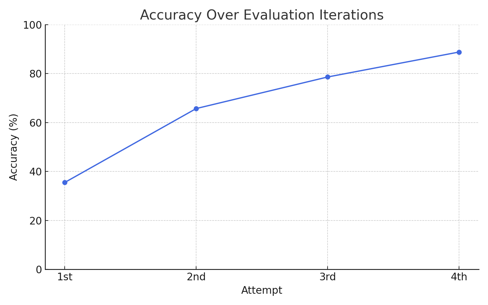

# OCR-to-Chat QA System

This project uses PaddleOCR to extract text from images and LangChain + OpenAI to generate intelligent question-answering capabilities over the extracted text. It also includes evaluation using BLEU, METEOR, and ROUGE scores.

## 🎥 Demo Video

The demo video showcases the full pipeline in action:

✅ Uploads an image containing swimlane diagrams.

🧠 Uses OCR to extract relevant text data from the image.

❓ Asks 3–5 context-aware questions across different swimlanes.

✅ Returns accurate answers by grounding the responses in extracted content.

🚫 For out-of-context or unrelated questions, the system smartly responds with: "The provided context doesn't have this information."

The video is captured [here](https://drive.google.com/file/d/16Lsx-SoG45bSPrOLD0FcgWfRiras6VHQ/view?usp=sharing)


## 🚀 Features

- OCR using [PaddleOCR](https://github.com/PaddlePaddle/PaddleOCR), results of OCR can be found in this [drive](https://drive.google.com/drive/folders/1gfpbGyFaQiVp3aE1lGQbtLybiTdHQKTk?usp=sharing)
- Context-aware Q&A using LangChain and OpenAI GPT
- Text similarity evaluation using BLEU, METEOR, and ROUGE
- Interactive UI built with Streamlit


## Setup Instructions

### 1. Clone the repository
```
git clone https://github.com/your-username/your-repo.git
cd your-repo
```
### 2. Create a virtual environment
```
python -m venv venv
source venv/bin/activate
```
### 3. Install dependencies
```
pip install -r requirements.txt
```
### 4. Download NLTK resources
```
import nltk
nltk.download('punkt')
nltk.download('wordnet')
```
### 5. Create a .env file
Add your OpenAI API key to a .env file in the root directory:
```
OPENAI_API_KEY=your-openai-api-key
```

## Running the App
Start the Streamlit app:
```
streamlit run streamlit_app.py
```

## 🔍 Model Research
This project involved in-depth [research]() to identify the most suitable models for the task of image-to-text question answering.

Investigated the need for structured text extraction and context-based question answering over domain-specific swimlane diagrams.

### Model Comparison & Testing
Compared various combinations of:

- OCR backends (Tesseract vs. PaddleOCR vs. EasyOCR)

- LLMs for QA (OpenAI GPT models, local alternatives)

- Retrieval mechanisms (FAISS + LangChain + OpenAI Embeddings)


✅ Final Model Choice

- OCR: Chose PaddleOCR for its high accuracy in extracting layout-sensitive and multilingual text.

- LLM QA: Used LangChain with ChatOpenAI for its robust contextual reasoning and support for retrieval-augmented generation (RAG).

- Retrieval: Employed FAISS vector store with OpenAI Embeddings for fast and accurate context lookups.


The selected combination offered:

- High accuracy on domain-restricted answers.

- Low latency (~2 seconds per query).

- Minimal hallucinations due to retrieval grounding.


## 📈 Evaluation Metrics
Evaluation was done using a mix of text similarity and domain precision metrics:

 - BLEU: Measures n-gram overlap between generated and ground truth answers.

- ROUGE: Focuses on recall and overlapping units.

- METEOR: Considers synonyms, stemming, and paraphrases.

- Common Words: Simple token match threshold for baseline accuracy.

✅ Answer was considered correct if any one metric met its respective threshold.




| Attempt | Queries | Correct | Accuracy  | Avg Latency |
| ------- | ------- | ------- | --------- | ----------- |
| 1       | 76      | 27      | 35.5%     | 2s          |
| 2       | 76      | 50      | 65.7%     | 2s          |
| 3       | 75      | 59      | 78.6%     | 2s          |
| 4       | 72      | 64      | **88.8%** | 2s          |

Each iteration involved:

- Refining ground truth answers.

- Tuning evaluation thresholds.

- Removing redundant or ambiguous queries.

Final result: 64 out of 72 queries correctly answered in the 4th iteration, showing high domain-specific comprehension and contextual accuracy.
